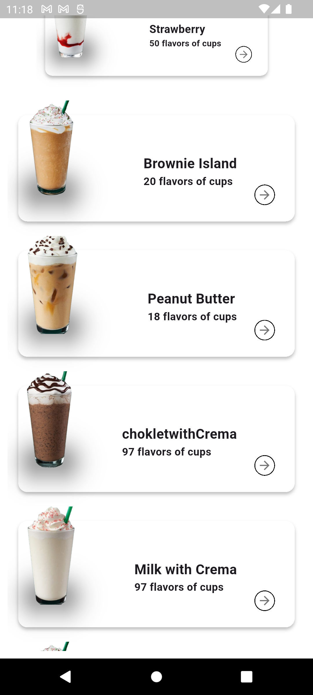
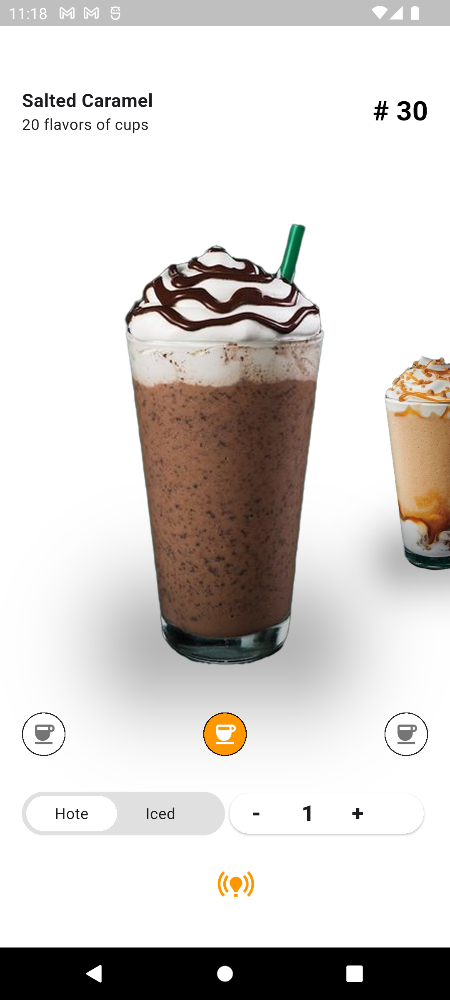

# ☕ Coffee App

A clean and minimal coffee shop UI built using Flutter.

---

## 📸 Screenshots

| Home Screen | Details Screen |
|-------------|----------------|
|  |  |

---

## ✨ Features

- 🧾 Product list with beautiful coffee cards  
- 📱 Responsive and modern UI  
- 🔄 Smooth navigation between screens  
- ⚙️ Built completely with Flutter & Dart

---

## 📦 Dependencies

- `flutter`
- `cupertino_icons`

---

## 🚀 Getting Started

To run the project locally, follow these steps:

```bash
flutter pub get
flutter run
